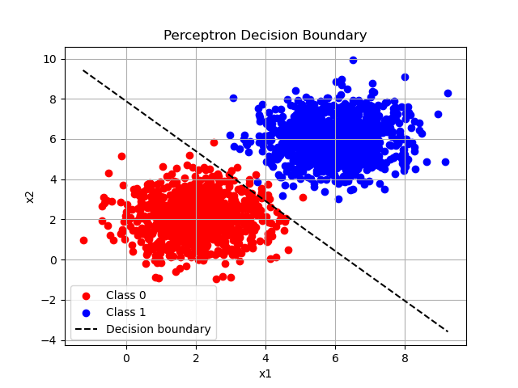

# 🧠 Perceptron from Scratch (Python + NumPy)

This project demonstrates a **Perceptron**, one of the most fundamental algorithms in machine learning, implemented from scratch using `NumPy`. It also includes a data generation function, training process, and visualization of the decision boundary.

---

## 📌 Project Overview

The perceptron is a **binary classifier** that learns a linear decision boundary between two linearly separable classes. It uses a **step activation function** (also called ramp function) to classify inputs.

- Programming Language: **Python**
- Libraries: `NumPy`, `Matplotlib`, `Pandas`
- Features:
  - Data generation for two classes
  - Perceptron model training
  - Accuracy evaluation
  - Visualization of decision boundary

---

## 📷 Output Example

Here is an example plot of the decision boundary after training:

> Replace the image below with your actual saved plot using `plt.savefig("plot.png")`



---

## 🧮 Mathematical Formulation

The perceptron predicts using the formula:

\[
z = \mathbf{w} \cdot \mathbf{x} + b
\]

\[
\hat{y} = 
\begin{cases}
1 & \text{if } z > 0 \\
0 & \text{otherwise}
\end{cases}
\]

During training, weights and bias are updated as:

\[
\mathbf{w} = \mathbf{w} + \alpha (y - \hat{y}) \cdot \mathbf{x}
\]

\[
b = b + \alpha (y - \hat{y})
\]

Where:
- \( \alpha \): learning rate
- \( y \): actual label
- \( \hat{y} \): predicted label

---

## 🔧 How to Run

1. Install dependencies:
```bash
pip install numpy matplotlib pandas
````

2. Run the script:

```bash
python perceptron.py
```

3. (Optional) Save the plot:

```python
plt.savefig("plot.png")
```

---

## 📂 File Structure

```
.
├── perceptron.py      # Main script with perceptron implementation and plotting
├── plot.png           # Saved plot (add after running)
└── README.md          # This file
```

---

## 📈 Performance

The model achieves **high accuracy** when trained on linearly separable data. Example:

```
Accuracy: 100.00%
```

---

## 🤖 Future Improvements

* Add support for non-linearly separable datasets
* Switch to sigmoid for logistic regression behavior
* Use real datasets for better testing
* Animate training updates over epochs

---

## 🧑‍💻 Author

**Yassine Ouali**
Feel free to contribute or reach out with suggestions!

---

## 📜 License

This project is open-source under the MIT License.

````

---

### Notes:
- To export the plot image and use it in the README, just add this line before `plt.show()`:

```python
plt.savefig("plot.png")
````

Let me know if you'd like a version that includes interactive GUI buttons or animation of the learning process.
